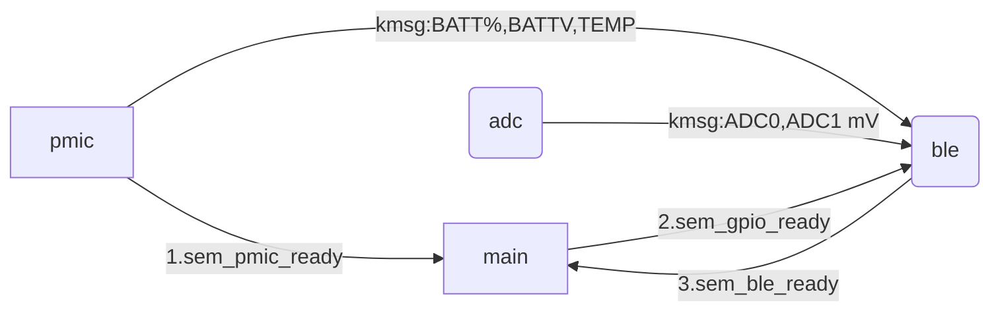

# npm2100_nrf54l15_BFG


<p align="center">
  <br>
  
  </br>
  This <b>unofficial</b> application demonstrates using an nRF54L15 as a Bluetooth Low Energy (BLE) peripheral,  powered by an nPM2100 power management IC (PMIC) and primary cell battery, as a wireless battery fuel gauge and PMIC controller.
</p>

> I am in no way affiliated with Id Software.
> 
> The acronym for **B**luetooth **F**uel **G**auge is coincidentally also a DOOM reference and I could not resist.
> 
> _DOOM was ported to the 5340: [DOOM on nRF5340](https://devzone.nordicsemi.com/nordic/nordic-blog/b/blog/posts/doom-on-nrf5340)_


# Requirements
## Hardware
- **nRF54L15 DK**
 
  
- **nPM2100 EK**

   

- **AA Battery** (other types work as well, see the [Battery Configuration](#battery-configuration) section) 

- **6x Female-Female jumper wires**

## Software
- [nRF Connect SDK](https://www.nordicsemi.com/Products/Development-software/nRF-Connect-SDK) `V3.0.2` to build and program.
  - Alternatively, grab a tagged release `.hex` file [here](https://github.com/droidecahedron/npm2100_nrf54l15_BFG/releases) and program your DK with either:
    -  [nRF Util](https://www.nordicsemi.com/Products/Development-tools/nRF-Util) and `nrfutil device program`
    -  [nRF Connect for Desktop](https://www.nordicsemi.com/Products/Development-tools/nrf-connect-for-desktop/download)'s Programmer application 

      
    -  or [J-Link](https://www.segger.com/downloads/jlink/).
- [nRF Connect for Mobile](https://www.nordicsemi.com/Products/Development-tools/nRF-Connect-for-mobile) for iOS/Android

# Overview
The nRF54L15 is an ultra low power wireless SoC, and the nPM2100 is an efficient boost regulator for primary-cell batteries.
The nPM2100 also has two output regulators, a boost and LDO/load switch.

The nPM2100-EK and primary cell battery provides power (via BOOST) to the nRF54L15-DK, and the nRF54L15-DK performs measurements, configurations, and acts as a BLE peripheral.

The nRF54L15 uses two on-chip ADC channels and measures the voltage of the BOOST and LDO/LS output of the nPM2100, and reports these statistics to a central device (likely a phone) via BLE. It also reports logs by default, so if you connect a USB cable you can read those logs out.

## Block Diagram
### Overall Application


### Fuel gauge block diagram


## BLE Data
The regulator output voltages and battery percentage have independent characteristics to read over BLE, but for demonstration purposes there is a summary characteristic to read all the values out as a string. (See the [example output](#example-output) section for more information.) Below is a table summary:

Statistic|Permissions|Unit|Individual Characteristic
---|---|---|----
Battery Percentage|Read|%|Yes
LDO/LS Output Voltage|Read and Write|mV|Yes
BOOST Output Voltage|Read|mV|Yes
Battery Voltage|Read|V|No
Battery Temp|Read|deg C|No

# Setting Up 
## Boards
- Switch the **nRF54L15-DK** Power switch (`SW4`) to OFF.
- Remove the jumper on `P6` on the **nRF54L15-DK**.
  - 
- Plug in the USB cable to the **nRF54L15-DK**. (_Read the NOTE after the last instruction_.)
- Using your female-female jumper wires, make the following connections between the boards:
  - `Port P1 Pin 11` of the **nRF54L15-DK** to the `VOUT` header on the **nPM2100-EK**
  - `Port P1 Pin 12` of the **nRF54L15-DK** to the `LS/LDO OUT` header on the **nPM2100-EK**
  - `Port P1 Pin 9` of the **nRF54L15-DK** to the `SDA` pin of the `TWI` header on the **nPM2100-EK**
  - `Port P1 Pin 8` of the **nRF54L15-DK** to the `SCL` pin of the `TWI` header on the **nPM2100-EK**
  - The __middle__ pin of the `VDDM current measure` header on the nRF54L15DK to the `VOUT` pin of the `TWI` header on the **nPM2100-EK**.
  - and tie the GNDs of the kits together. _Below is a [table summary](table_of_connections), a [wiring diagram](wiring-diagram), and a [photo](image-example) of how it should be wired together._

- Insert your provided battery into its corresponding battery holder, and insert that into the BATTERY INPUT connector on the EK. _This sample is by default configured for the single AA battery board._
- When everything is connected correctly, switch `SW4` on the **nRF54L15-DK** to `ON`.
- Program the board as with other nRF Connect SDK samples and applications.

>[!NOTE]
> You can run this application WITHOUT the USB cable attached. _You will not see LEDs blink if not connected via USB due to how the DK/EK are designed._
>
> If the board is already programmed, power the **nRF54L15-DK** OFF with `SW4`, unplug the USB cable from the DK, then switch it back on.

 ### Table of Connections
 Helpful silk screen labels in parenthesis
  nPM2100EK Header|npm2100EK Pin|nRF54L15DK Header|nRF54L15DK Pin
  ---|---|---|---
  P11 (TWI)|GND|P6 (VDDM Current Measure)|GND
  P11 (TWI)|VOUT|P6 (VDDM Current Measure)|VDDM (Middle Pin)
  P11 (TWI)|SCL|P1 (PORT P1)|P1.8 (08)
  P11 (TWI)|SDA|P1 (PORT P1)|P1.9 (09)
  P9|VOUT|P1 (PORT P1)|P1.11 (11)
  P5|LS/LDO OUT|P1 (PORT P1)|P11.12 (12)
  
### Wiring Diagram
> [!NOTE]  
> The orientation of the boards in this image is not a requirement, as long as everything is connected correctly.


### Image Example


#### Battery Configuration
You can select different battery configuration in `prj.conf` with the symbol `CONFIG_BATTERY_MODEL`. The options are listed in `Kconfig`, but here is a table.

Battery Model|KConfig
---|---
Single AA|BATTERY_MODEL_ALKALINE_AA
Single AAA|BATTERY_MODEL_ALKALINE_AAA
Series AA|BATTERY_MODEL_ALKALINE_2SAA
Series AAA|BATTERY_MODEL_ALKALINE_2SAAA
LR44 Coin Cell|BATTERY_MODEL_ALKALINE_LR44
Lithium Manganese Dioxide CR2032|BATTERY_MODEL_LITHIUM_CR2032

Based on this config, the fuel gauge initialization in `pmic.c` should pull the appropriate model.

## Building and Running
This application is built like all other typical nRF Connect SDK applications.
To build the sample, follow the instructions in [Building an application](https://docs.nordicsemi.com/bundle/ncs-latest/page/nrf/app_dev/config_and_build/building.html#building) for your preferred building environment. See also [Programming an application](https://docs.nordicsemi.com/bundle/ncs-latest/page/nrf/app_dev/programming.html#programming) for programming steps.

`west build -b nrf54l15dk/nrf54l15/cpuapp -p` followed by `west flash`.

Use the nRF Connect for Mobile app and use the scan filter for "npm" to find `npm2100_nrf54l15_BFG` (which is the name set in `prj.conf`).

<p align="center">
  
</p>

From here, there are a few attributes you can play with. 
The main ones are 2100 Read All, and LS/LDO Write.
Below is a helpful table to navigate them, since they have unrecognized UUIDs embedded with hexadecimal characters that make it easier to find them.

Characteristic|UUID prefix|Purpose|Data type
---|---|---|---
**2100 Read All**|`0x21002EAD-0xA770`|Plaintext "read all" of pmic values (batt%, die temp, battV) and measured ADC values of the pmic regulator outputs|String
BOOST Read|`0xB005712D-0x2EAD`|Measured ADC result of the nPM2100 BOOST regulator output in mV|signed int
LS/LDO Read|`0xL5LD012D-0x2EAD`|Measured ADC result of the nPM2100 LDO/LS regulator output in mV|signed int
**LS/LDO Write**|`0x757D0111-0x217E`|Lets you request a change in the LS/LDO output voltage in mV|byte array
Battery Read|`0xBA77E129-0x2EAD`|Measured the battery% of the fuel gauge|unsigned int

> [!IMPORTANT]
> 1. For the read characteristics, the nRF Connect for Mobile lets you change the formatting to make it easier to read the values, since by default it will be byte arrays. 
>   (on iOS it is the little `"` symbol.). Select UTF-8 for the READ ALL characteristic to see a human readable string.

> 3. For the LS/LDO Write characteristic, the LDO only accepts steps of 50mv. So to request 2300mV, you need to write `2300`.
>    
>    If you request anything that is not in a step of 50mV, the device will ignore your request, and will output an error log message.
>
>    The request range is also bounded by the LSLDO outputs, so you can only request 800-3000 mV.
>
>    If you subscribe to the READ ALL characteristic or the LSLDO Read characteristic, you should see the LS/LDO ####mV value change after your write request is processed!

So, with that table and information in mind, press the download/down arrow symbol on any characteristics you want to read, and the upload symbol on the LSLDO Write characteristic to request a new output voltage from the LDO/LS.

## Example Output
### nRF Connect for Mobile (iOS)

#### Zoomed in screenshot of the RD ALL Characteristic


#### Read all characteristic reflecting a 1100 mV write request for the LSLDO voltage


#### LSLDO RD characteristic showing same result.


### Logs
#### startup
```
*** Booting nRF Connect SDK v3.0.2-89ba1294ac9b ***
*** Using Zephyr OS v4.0.99-f791c49f492c ***
[00:00:00.005,935] <inf> ble: ble write thread: enter
[00:00:00.005,948] <inf> pmic: PMIC device ok
[00:00:00.005,978] <inf> pmic: nRF Fuel Gauge version: 1.0.1

[00:00:00.006,025] <inf> ble: ble write thread: woken by main
[00:00:00.006,074] <inf> bt_sdc_hci_driver: SoftDevice Controller build revision: 
                                            89 9a 50 8a 95 01 9c 58  fc 39 d2 c1 10 04 ee 02 |..P....X .9......
                                            64 ce 25 be                                      |d.%.             
[00:00:00.006,168] <inf> adc: ADC Thread sent: Ch0=3072 mV, Ch1=2397 mV
[00:00:00.007,065] <inf> bt_hci_core: HW Platform: Nordic Semiconductor (0x0002)
[00:00:00.007,079] <inf> bt_hci_core: HW Variant: nRF54Lx (0x0005)
[00:00:00.007,103] <inf> bt_hci_core: Firmware: Standard Bluetooth controller (0x00) Version 137.20634 Build 2617349514
[00:00:00.007,498] <inf> bt_hci_core: Identity: F2:2F:2D:28:32:A4 (random)
[00:00:00.007,514] <inf> bt_hci_core: HCI: version 6.0 (0x0e) revision 0x30f3, manufacturer 0x0059
[00:00:00.007,528] <inf> bt_hci_core: LMP: version 6.0 (0x0e) subver 0x30f3
[00:00:00.007,533] <inf> ble: Bluetooth initialized
[00:00:00.008,012] <inf> ble: Advertising successfully started
[00:00:00.008,044] <inf> ble: BLE thread rx from ADC: Ch0(BOOST)=3072 mV Ch1(LDOLS)=2397 mV
[00:00:00.012,928] <inf> pmic: Fuel gauge initialised for Alkaline AA battery.
[00:00:00.018,192] <inf> pmic: PMIC Thread sending: V: 1.587, T: 26.98, SoC: 100.00
[00:00:00.018,220] <inf> ble: BLE thread rx from PMIC: V: 1.59 T: 26.98 SoC: 100.00 
[00:00:00.018,226] <inf> ble: BLE Thread does not detect an active BLE connection
[00:00:01.006,410] <inf> adc: ADC Thread sent: Ch0=3065 mV, Ch1=2394 mV
[00:00:01.006,432] <inf> ble: BLE thread rx from ADC: Ch0(BOOST)=3065 mV Ch1(LDOLS)=2394 mV
[00:00:01.023,877] <inf> pmic: PMIC Thread sending: V: 1.575, T: 26.98, SoC: 100.00
[00:00:01.023,905] <inf> ble: BLE thread rx from PMIC: V: 1.58 T: 26.98 SoC: 100.00 
[00:00:01.023,910] <inf> ble: BLE Thread does not detect an active BLE connection
```

#### Connecting
```
[00:00:01.524,455] <inf> ble: Connected
[00:00:01.524,471] <inf> ble: Connection parameters: interval 30.00 ms, latency 0 intervals, timeout 720 ms
[00:00:02.006,595] <inf> adc: ADC Thread sent: Ch0=3072 mV, Ch1=2394 mV
[00:00:02.006,616] <inf> ble: BLE thread rx from ADC: Ch0(BOOST)=3072 mV Ch1(LDOLS)=2394 mV
[00:00:02.029,228] <inf> pmic: PMIC Thread sending: V: 1.575, T: 26.98, SoC: 100.00
[00:00:02.029,256] <inf> ble: BLE thread rx from PMIC: V: 1.58 T: 26.98 SoC: 100.00 
[00:00:02.029,276] <wrn> ble: Warning, notification not enabled for boost mv characteristic
[00:00:02.029,290] <wrn> ble: Warning, notification not enabled for lsldo mv characteristic
[00:00:02.029,307] <wrn> ble: Warning, notification not enabled for batt read characteristic
[00:00:02.029,514] <wrn> ble: Warning, notification not enabled for pmic stat characteristic
[00:00:02.524,794] <inf> ble: PHY updated. New PHY: 1M
[00:00:02.524,839] <inf> ble: Data length updated. Length 124/124 bytes, time 2120/2120 us
[00:00:02.524,939] <wrn> bt_l2cap: Ignoring data for unknown channel ID 0x003a
[00:00:02.566,922] <inf> ble: MTU exchange successful
[00:00:02.566,931] <inf> ble: New MTU: 117 bytes
[00:00:03.006,834] <inf> adc: ADC Thread sent: Ch0=3058 mV, Ch1=2394 mV
[00:00:03.006,853] <inf> ble: BLE thread rx from ADC: Ch0(BOOST)=3058 mV Ch1(LDOLS)=2394 mV
```

#### Requesting a valid LS/LDO voltage change
```
[00:01:06.020,801] <inf> ble: BLE thread rx from ADC: Ch0(BOOST)=3058 mV Ch1(LDOLS)=808 mV
[00:01:06.397,463] <inf> pmic: PMIC Thread sending: V: 1.612, T: 26.98, SoC: 100.00
[00:01:06.397,491] <inf> ble: BLE thread rx from PMIC: V: 1.61 T: 26.98 SoC: 100.00 
[00:01:07.020,964] <inf> adc: ADC Thread sent: Ch0=3065 mV, Ch1=808 mV
[00:01:07.020,983] <inf> ble: BLE thread rx from ADC: Ch0(BOOST)=3065 mV Ch1(LDOLS)=808 mV
[00:01:07.403,354] <inf> pmic: PMIC Thread sending: V: 1.587, T: 26.98, SoC: 100.00
[00:01:07.403,386] <inf> ble: BLE thread rx from PMIC: V: 1.59 T: 26.98 SoC: 100.00 
[00:01:08.021,194] <inf> adc: ADC Thread sent: Ch0=3062 mV, Ch1=808 mV
[00:01:08.021,211] <inf> ble: BLE thread rx from ADC: Ch0(BOOST)=3062 mV Ch1(LDOLS)=808 mV
Received lsldo wr data, handle 0, conn 0x20002888, data: 0x2400
[00:01:08.318,285] <inf> ble: REQUESTED LSLDO VOLTAGE (mV): 2400
[00:01:08.318,897] <inf> pmic: LSLDO Voltage set to: 2400000 uV
[00:01:08.409,409] <inf> pmic: PMIC Thread sending: V: 1.600, T: 26.98, SoC: 100.00
[00:01:08.409,442] <inf> ble: BLE thread rx from PMIC: V: 1.60 T: 26.98 SoC: 100.00 
[00:01:09.021,426] <inf> adc: ADC Thread sent: Ch0=3048 mV, Ch1=2394 mV
[00:01:09.021,445] <inf> ble: BLE thread rx from ADC: Ch0(BOOST)=3048 mV Ch1(LDOLS)=2394 mV
[00:01:09.414,987] <inf> pmic: PMIC Thread sending: V: 1.587, T: 26.98, SoC: 100.00
[00:01:09.415,015] <inf> ble: BLE thread rx from PMIC: V: 1.59 T: 26.98 SoC: 100.00 
[00:01:10.021,642] <inf> adc: ADC Thread sent: Ch0=3030 mV, Ch1=2401 mV
[00:01:10.021,663] <inf> ble: BLE thread rx from ADC: Ch0(BOOST)=3030 mV Ch1(LDOLS)=2401 mV
```

#### Connected, but not subscribed to notifications
```
[00:00:02.006,595] <inf> adc: ADC Thread sent: Ch0=3072 mV, Ch1=2394 mV
[00:00:02.006,616] <inf> ble: BLE thread rx from ADC: Ch0(BOOST)=3072 mV Ch1(LDOLS)=2394 mV
[00:00:02.029,228] <inf> pmic: PMIC Thread sending: V: 1.575, T: 26.98, SoC: 100.00
[00:00:02.029,256] <inf> ble: BLE thread rx from PMIC: V: 1.58 T: 26.98 SoC: 100.00 
[00:00:02.029,276] <wrn> ble: Warning, notification not enabled for boost mv characteristic
[00:00:02.029,290] <wrn> ble: Warning, notification not enabled for lsldo mv characteristic
[00:00:02.029,307] <wrn> ble: Warning, notification not enabled for batt read characteristic
[00:00:02.029,514] <wrn> ble: Warning, notification not enabled for pmic stat characteristic
```

#### Disconnected
```
[00:01:26.449,365] <inf> ble: Disconnected (reason 19)
[00:01:26.449,389] <inf> ble: Connection object available from previous conn. Disconnect is complete!
[00:01:26.449,855] <inf> ble: Advertising successfully started
```


# Software Description
Standard BLE peripheral, except larger MTU and DLE is used since the plaintext string is significantly larger than the 20 bytes of payload you can get by default.
All other notification information fits without needing it. 

PHY negotiation is also present, the sample prefers CODED PHY by default if available. 
Since the transmitted data is minimal, the lowered bitrates aren't much of a dealbreaker in exchange for link robustness.
The ADC portion is using standard Zephyr API. 

For a step-by-step guide on the ADC module and BLE characteristics, visit this step-by-step workshop [peripheral_dmm](https://github.com/droidecahedron/nrf_peripheral_dmm/tree/main), or the [Nordic DevAcademy](https://academy.nordicsemi.com/).

There are 4 primary modules:
1) main
2) adc
3) ble
4) pmic

Below is a table of pertinent (not all) files in this project and their purpose.
File|purpose|
---|---
main.c|initial setup of the DK, relaying synchronization information between LE module and PMIC module.
adc/npm_adc.c|performs initialization of ADC and sends kernel messages to the BLE module with the measured ADC values, which should be tied to the nPM2100 regulator outputs.
pmic/pmic.c|performs initialization of the nPM2100, has a fuel gauging task that sends kernel messages to the BLE module with the results, as well as a task that is set up to handle received requests to update the LSLDO regulator output voltage from the BLE module.
ble/ble_periph_pmic.c|houses the bulk of the BLE application code, is the recipient of most of the messages from the other software modules, but waits to sync with the PMIC module on startup.
common/tsync.h|breaks out easy semaphore access between the modules.


The following flowchart shows the semaphore exchange order, as well as the kmsg directions from each module.


# Notes
> [!IMPORTANT]
>Although this sample uses a battery, it is **not** optimized for power. The nRF54L15 has great active power numbers but this sample does not incorporate power saving techniques.
>
> I omitted power saving features to avoid the codebase becoming too dense. You can see some examples of power optimzation techniques in the list below.

1. [i2c_ble_peripheral](https://github.com/droidecahedron/i2c_ble_peripheral/tree/main)
2. [blinkbuttonsleep and its various branches](https://github.com/droidecahedron/blinkbuttonsleep)
3. [Nordic official power optimization recommendations](https://docs.nordicsemi.com/bundle/ncs-latest/page/nrf/test_and_optimize/optimizing/power_general.html)
